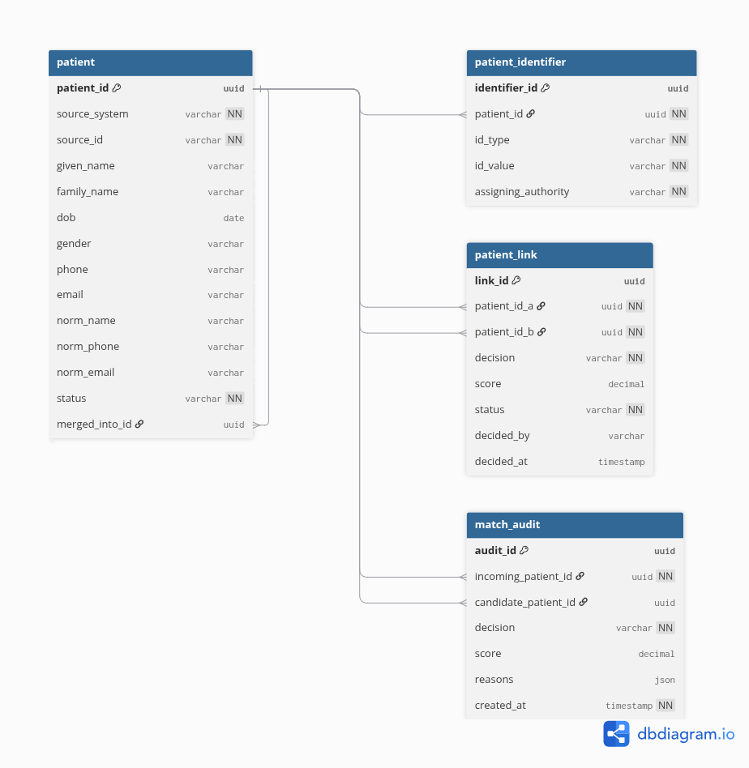

# Patient Management Application

A full-stack patient management application built as a technical assessment.

| Task | Description | Location |
|---|---|---|
| **#1** | MPI data model and patient matching algorithm | [`task1-mpi/`](task1-mpi) |
| **#2** | Patient CRUD web application | [`patient-app/`](patient-app) (backend), [`patient-web/`](patient-web) (frontend) |

---

## Tech stack

| Layer | Technology |
|---|---|
| Backend | Java 17, Spring Boot 3.5.16, Spring Web, Spring Data JPA, Bean Validation |
| Database | H2 (in-memory) with Liquibase migrations |
| Frontend | Angular 20.3 (standalone components, signals), TypeScript |
| Build | Maven (wrapper included), Angular CLI |
| Tests | JUnit 5, Mockito, AssertJ, MockMvc |

---

## Prerequisites

- **JDK 17** or later
- **Node.js 20** or later (developed on 22)

Maven does not need to be installed — the project ships with the Maven wrapper (`./mvnw`).

---

## Running the application

Two terminals are required.

### 1. Backend — http://localhost:8080

```bash
cd patient-app
./mvnw spring-boot:run
```

On startup, Liquibase creates the schema and loads **25 sample patients**.

The H2 console is available at http://localhost:8080/h2-console
(JDBC URL `jdbc:h2:mem:patientdb`, user `sa`, empty password).

> If port 8080 is already in use, start it elsewhere with
> `./mvnw spring-boot:run -Dspring-boot.run.arguments=--server.port=8081`
> and update `apiUrl` in `patient-web/src/environments/environment.development.ts` to match.

### 2. Frontend — http://localhost:4200

```bash
cd patient-web
npm install
npm start
```

---

## Running the tests

```bash
cd patient-app && ./mvnw test
```

**31 tests**, covering:

| Test class | Count | Scope |
|---|---|---|
| `PatientRepositoryTest` | 8 | JPA layer against a real in-memory database (`@DataJpaTest`) |
| `PatientServiceTest` | 12 | Business rules in isolation, repository mocked (Mockito) |
| `PatientControllerTest` | 10 | HTTP layer: routing, JSON, validation, error mapping (`@WebMvcTest`) |
| `PatientAppApplicationTests` | 1 | Spring context loads |

Frontend build check:

```bash
cd patient-web && npm run build
```

---

## API

Base path: `/api/patients`

| Method | Path | Description | Success |
|---|---|---|---|
| `GET` | `/api/patients` | Paged list. Query params: `keyword`, `page`, `size`, `sort` | 200 |
| `GET` | `/api/patients/{id}` | Single patient | 200 |
| `POST` | `/api/patients` | Create | 201 |
| `PUT` | `/api/patients/{id}` | Update | 200 |
| `DELETE` | `/api/patients/{id}` | Delete | 204 |

`keyword` matches against PID, first name, last name, and the combined full name, case-insensitively.

### Error responses

| Status | When |
|---|---|
| `400 Bad Request` | Validation failed — response includes a `fieldErrors` map keyed by field path |
| `404 Not Found` | Patient does not exist |
| `409 Conflict` | PID already belongs to another patient |

Example list response:

```json
{
  "content": [
    {
      "id": 1,
      "pid": "P001",
      "firstName": "Ali",
      "lastName": "Rahman",
      "dateOfBirth": "1990-01-15",
      "gender": "MALE",
      "phoneNo": "0412345678",
      "address": {
        "addressLine": "12 George St",
        "suburb": "Sydney",
        "state": "NSW",
        "postcode": "2000"
      }
    }
  ],
  "page": 0,
  "size": 10,
  "totalElements": 25,
  "totalPages": 3,
  "first": true,
  "last": false
}
```

---

## Features

- Grid listing patients with **server-side pagination** — only the current page is fetched from the database (`LIMIT`/`OFFSET`), and the page controls are driven by `totalElements` returned by a `COUNT` query
- Search by PID or patient name, debounced by 300 ms so typing does not flood the server
- Create, update and delete patients
- Adjustable page size (5 / 10 / 25)
- Validation on both the client and the server, with server-side field errors displayed against the matching form control

---

## Design decisions

**Surrogate primary key, separate from PID.** `id` is a database-generated `BIGINT`; `pid` is the business identifier users search by. Business identifiers can change format or be corrected, so they are unsuitable as a primary key. `pid` is protected by a unique constraint instead.

**Postcode and phone number stored as `String`.** Australian postcodes may start with a zero (`0800`, Darwin). Stored as a number, that leading zero is lost.

**Address mapped with `@Embeddable`.** The four address fields live in the `patient` table — no join, no extra entity — but are grouped into one object in Java, mirroring how the specification groups them.

**Liquibase owns the schema; Hibernate only validates it.** `spring.jpa.hibernate.ddl-auto=validate` means the application fails fast at startup if the entities and the migrations drift apart, rather than silently patching the schema.

**Sample data is scoped to a Liquibase context.** The seed changeset is tagged `context="dev"`, so it never runs in tests or in any environment that does not explicitly ask for it.

**A dedicated `PageResponse` DTO instead of returning Spring's `Page`.** Serialising `Page` directly leaks Spring internals into the JSON contract and can change between Spring versions. `PageResponse` keeps the API shape stable and is mirrored one-to-one in the TypeScript model.

**`409 Conflict` for a duplicate PID, not `400`.** The request itself is well-formed; it conflicts with existing state. The service performs the check to produce a readable message, while the database unique constraint remains the actual guarantee — the service check alone cannot survive two concurrent requests.

---

## Known limitations

- **Search does not use an index.** The `LIKE '%keyword%'` pattern required for "contains" matching cannot use a B-tree index, so name searches perform a table scan. This is acceptable at this data volume; a production system would use full-text search.
- **No authentication or authorisation.** Out of scope for this exercise.
- **H2 in-memory only.** Data is lost on restart. Because the schema is managed by Liquibase, switching to MariaDB or PostgreSQL requires only a datasource change.

---

## Task #1 — Master Patient Index

- `task1-mpi/erd.dbml` — data model source (4 entities). Paste into [dbdiagram.io](https://dbdiagram.io) to re-render it.



- `task1-mpi/src/PatientMatcher.java` — the matching function.

```bash
cd task1-mpi && javac -d out src/PatientMatcher.java && java -cp out PatientMatcher
```

The matcher normalises name, date of birth, phone and email, then requires at least 2 of the 4 fields to agree with no field in conflict for `AUTO_MATCH`. Weaker or contradictory evidence yields `REVIEW`; insufficient evidence yields `NO_MATCH`. Missing data is treated as unknown rather than as a conflict.

Deliberately out of scope in the short version: fuzzy name matching, deterministic short-circuit on strong identifiers (MRN / National ID), and per-field weighting — a date-of-birth conflict should count for more than an email conflict.
